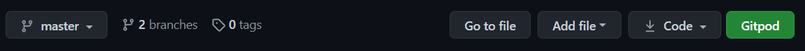

# **FTE Calc**

# Overview
FTE Calc is an interactive calculator designed to make producing full time equivalent salaries for academic support staff quick and easy.  A multi academy trust may well operate over multiple counties with associated pay scales, holiday allowances and pension contribution bands.  Each of those areas may also have subsets which change based on length of service, for example, or by grade.  Translation to term-time only pay from FTE is often undertaken by reading from multiple tables and making manual calculations which leaves a large number of opportunities for human error to creep in.

The calculator is being developed with the input of a multi-academy trust who are in this position, and as such, the color scheme and fonts are in line with their branding, though tweaked a little for accessibility.

The pay scales and all other data used in this project are entirely fictional. These will be replaced with the actual data when the calculator is finalised and used locally.

# Index
1. [UX](#ux)
    * [User Stories](#user-stories)
    * [Strategy](#strategy)
    * [Scope](#scope)
    * [Structure](#structure)
    * [Skeleton](#skeleton)
    * [Surface](#surface)
1. [Features](#features)
    * [Existing Features](#existing-features)
    * [Features for Future Implementation](#features-for-future-implementation)
1. [Testing](#testing)
1. [Development Life Cycle](#development-life-cycle)
1. [Deployment](#deployment)
    * [Via GitPod](#deployment-of-the-page)
    * [Cloning Locally](#how-to-run-the-code-locally)
1. [Technologies Used](#technologies-used)
1. [Credits](#credits)
    * [Website](#website-credits)
    * [README](#readme-credits)

Note, testing information can be found in a separate document:
* [Testing](TESTING.md)

## UX

### **Overview and Broad Design Choices**
The colour scheme and font choices have been taken from the branding of the academy trust which contributed to the production of the page, however some colour combinations were tweaked slightly to improve acessibility.

Otherwise, the page is designed primarily with the end user in mind, since their goals are completely aligned with those of the owners.  The project is a one page design as the user will want to open the page, enter the data, get the results and close it or restart the calculation for another staff member as quickly as possible.

There is a brief summary of how the calculator works at the top of the page, along with the information required to complete an FTE request.  This is deliberately short and to the point, as a returning user will want to get straight to the calculator every time.  After discussion with end users the Abour section is toggle-able, and the status of this is saved to local storage every time it is changed.

The calculator itself is fluid and dynamic, with the sole intention of reducing the required number of clicks/keystrokes to as few as possible.  Drop down menus were considered for data selection, and a scrolling number selector for hours entry.  These were both rejected on the basis that this approach would require twice as many clicks as simply having dynamic clickable content right there on the page.  The summary data is returned in a plain, simple format to make it easy to copy and paste for inclusion on contracts or pay queries.  Finally the print styles have been refined such that the calculator and results will fit easily on to an A4 page for printing or saving to PDF.

There is a closing summary at the bottom of the page referring to any publicly available resources, and reminding the user to print or save the page as evidence of the basis of calculation.  This section includes a map which highlights an area on the map which would relate to the specific regions in question.  This uses placeholder data for the project.  Finally, this section asks the user to check that the pay scales have not been changed (this generally happens annually) since the page was last updated, with the last updated date shown clearly in the footer.

The footer also contains a Contact modal link which feeds back to the developer, so that any issues can be resolved.

### **User Stories**
1. As a new user, I want to immediately find information on how to use the website.
1. As a new user, I want to immediately find information on what I need to complete the task I came for.
1. As a new user, I want to very quickly, intuitively learn exactly how the calculator is used to get the data I came for.
1. As a returning user, I want to get straight to using the calculator without pointless interaction such as scrolling or clicking.
1. As a returning user, I want to be able to provide feedback with regard to my needs/issues with the website.
1. As a frequent user, I want to know that the webiste is updated with relevant infomation in a timely manner, or to be able to update the source data myself.

These stories are addressed fully in the [Testing](TESTING.md) document.

### **Strategy**
*Who is the website for?*

The website is for academic institutions with one or more payscales/holiday allowances who need to quickly and accurately calculate term-time only salaries from full time equivalent figures.

*What does the owner of the website need/want?*

The owner of the website wants its staff to quickly and accurately obtain the data they need for HR and payroll purposes.

*What do the users of the website need/want?*

The user needs are closely aligned with the owner needs and wants, in that they too wish to spend as little time as possible on the task at hand, whilst simultaneously improving accuracy.

*Broadly, how does the website meet these needs?*

Single page application, no wasted navigation time. The interface is also designed to reduce the click burden of the user which in turn should improve time consumption.  The results should be displayed after four clicks and four keystrokes. There is an intermediate check of the full time figures obtained, to ensure source data is correct.

Owner aims:
* Improve accuracy and reduce payroll and contractual errors requiring resolution.
* Provide intuitive, clear resource for staff to improve efficiency.
* Updatable source data, prefereably by user/owner. 

User aims:
* Improve accuracy to reduce human error requiring resolution.
* Spend less time on manual calculations and reading tables.
* Current, relevant data at all times.

### **Scope**
*Why does the website exist?*

The website exists to meet a real world need for accurate, recordable and timely data.

*What does it need to meet the user/owner aims?*

It needs to be clearly laid out, with obvious instructions and an intuitive interface.  It also needs to always produce reliable data or explain why it cannot so that the user can alter their approach as necessary.

#### Feature Viability

| # | Feature | Importance | Viability | Comment |
|---| ------- | :--------: | :-------: | ------- |
1.| Clear instructions | 5 | 5 | Y - Essential for use, easy to include
2.| Direct navigation | 5 | 5 | Y - One aim is to improve efficiency
3.| Dynamic response to data input | 5 | 4 | Y - This is the purpose of the website
4.| Elegant error handling | 4 | 4 | Y - Required for user feedback
5.| Enable user/owner data updates | 3 | 2 | M - Developer unsure of source data accessibility
T.| Total score | 22 | 20 |

#### Feature Plan
First increment:
* Include features 1-4 above.
* Responsive design, though primary use likely to be via PC/laptop.  Include design for larger screen sizes.
* Data source either from csv or arrays/objects within code.

Second increment:
* Improve data source to csv or Google Sheets API.

Third increment:
* Enable user update of data source and provide instructions on how-to.

### **Structure**
* See Information Grouping [mind map here](assets/documents/structure.pdf).

### **Skeleton**
In line with structure map and user needs, the wireframes show the initial desired layout which has the primary intention of reducing user input to a minimum.  Website is most likely to be used on laptop/PC with second large screen, but should be scalable for field staff working from Surfaces/iPads as a minimum.

#### Wireframes

##### Original
1. [Mobile](assets/documents/fte-calc-mobile.pdf) 375px
1. [Tablet](assets/documents/fte-calc-tablet.pdf) 768px
1. [PC/Laptop](assets/documents/fte-calc-pc.pdf) 1200px
1. [Large Screen](assets/documents/fte-calc-large.pdf) 2560px

##### Final
1. [Mobile](assets/documents/fte-calc-mobile-final.pdf) 375px
1. [Tablet](assets/documents/fte-calc-tablet-final.pdf) 768px
1. [PC/Laptop](assets/documents/fte-calc-pc-final.pdf) 1200px

##### Summary of Changes
* About and More Info sections can be toggled on or off and the status is saved to local storage for continuity on next use.
* Added image to About section as very text heavy.
* Changed paragraph order in About section to move required info list to the end as disrupting read flow and display.
* Added progress indicator bar on PC, this is not shown on tablet or mobile as the scrolling nature of the page renders the progress bar invisible for most of the input.
* Changed service length input from Radio to matched buttons as better fit with the rest of the style of the webpage.  Even with styling adjusted, the radio buttons looked small and out of touch with the rest of the inputs.
* After meeting with partner, change weeks to text input as some legacy agreements contain working weeks such as 38.2 to represent term time only plus a certain number of inset days.  This does produce issues with anticipated error handing and data input control which will be addressed below.
* Introduce map to visually represent selected areas.
* Large screen design abandoned as Bootstrap column size pixel limitation makes manipulating the data side by side very difficult, and would require significant custom styling and media queries to achieve.

### **Surface**

#### Colours
The colours used are taken from the brand of the trust involved in production of the page to give an inclusive, seamless feel for staff using the tool.  Some of the colours have been changed slightly to improve distiction for colourblind users.

#### Typography
Thought process behind font choices:

As with colours, the font chosen is taken from the branding of the trust.  Various weights are used for the logo, headinngs, body and calculator to give the feel of variety but maintain consistency.

## Features

### **Existing Features**
Features common to all pages/sections:
* Responsive navigation which is collapsed on mobile devices to a hamburger menu.
* Focus on efficient interaction as a priority.
* Consistent design providing user feedback for all interactive elements.

#### Calculator Page
* Fully interactive dynamic interface.
* Information panes can be toggled on and off.
* Status of toggled elements saved to local storage.
* Very clear user feedback on error handling.
* Self resets if user repeats earlier step.
* Maps API provides graphic feedback for region selection.

### **Features for Future Implementation**
1. Data input from csv files: this would enable the end user to update the source data when pay scales are updated each year in a simple fashion.
1. General code refactoring and elimination of global variables: global variables are a significant error risk as they can be (and are) targeted by multiple functions.  The knowledge of the developer was not sufficient to facilitate writing the code in a more secure fashion at the time of development, and the use of global variables is generally noted as a common issue amongst beginner developers.  This improvement would increase the security and stability of the calculator.
1. Once data fetched from csv files, have the pay scales etc available as a collapsible section for reference.

## Testing

This information is held in the [Testing](TESTING.md) file.

## Development Life Cycle

This section is to provide an brief insight into how the approach to the code structure of the website was expected to work, what changed and why, and then to summarise how the creator would now approach replicating the project.

Changes to design are documented in the [UX section](#ux) under [wireframes](#wireframes).

The project was deployed using GitHub pages once the basic structure of the page was complete.  This allowed for continuous delivery as each change was made, and pushed and enabled testing of the page during development on different devices and by different users with different needs.

Commits were made as each section of each page/interactive feature was added and pushed once a section was complete.

### **Reflections on General Approach to Build**
As reflected in the documentation for [MS1](https://github.com/lilblupig/curls), a general lack of understanding of the technologies involved have influenced the way this project was approached.  There was an attempt to mitigate this for this project by completing further courses and tutorials alongside the course content, but the reality is that building a self-designed project is very different to working through a tutorial.  Further to this reflection, it is understood that this very steep learning curve is likely to be exhibited for all projects working with a new language or technology.

The approach to this project would be similar overall to that taken, but greater understanding of JavaScript and jQuery would mean some technical aspects would have been approached differently.

### **Lessons Learned**
There were significant issues with the relity of extracting information from objects and arrays initially, despite extensive research and planning.  The intended plan to work from a JSON object for each pay scale was derailed primarily by this.  With hindsight, most of the issues experienced stemmed from confusing vanilla javascript methods and syntax with those used by jQuery and muddling the two.

Passing data between functions is very important, and this was another significant concept which lacked understanding in reality, again, despite considerable research and practice.  This led to the use of global variables for storing data to be passed between functions.  Guarding the integrity of global variables was time consuming in its own right, with each use or referral being checked for the possibility of corruption and unintended consequences.

A recent foray into PHP, and the lack of global variables as a resource has forced a more rudimentary understanding of passing data using functions and parameters.

#### Preparation
The project was approached from inception as a user experience centered project.  In this case, the user requirements are exactly the same as the owner requirements: to achieve consistent results in as short a period of time as possible.  The five planes of UX design were explored and built upon to create a design which is geared almost exclusively towards the niche end use.

Attention was then turned to how to achieve this design, and how to make the components work.  The knowledge that the source data will change annually fuelled the initial plan that data would be sourced from csv or possibly Google Sheets API.

#### Build
The basic structure of the HTML, CSS and Bootstrap page was constructed first, with static elements standing in for dynamic content during the build.  Once complete, this was deployed to GitHub pages in order to undertake initial device responsiveness testing and to facilitate continuous deployment testing of new features moving forward.

From this point, the master was branched for all changes to insulate functional content from the effects of any potentially detrimental changes.  Pull requests were undertaken at logical intervals and new branches created to continue development.

The plan to use csv files to provide data was soon overridden as there were no readily available guides on parsing csv data to JSON without the use of an external resource.  The decision was made at this point to create a JSOn object of the payscales and use this.  Once again, this was impacted by the inability to extract the required information from the JSON object.

The approach was revised at this point to look at the requirements of each part of the calculator, provide the data needed in the simplest form and just get started on making the components work.  As such, the source data file is initially full of simple arrays and objects and the functions that deal with them are large and quite repetetive.

This does improve as the project proceeds, with the functions dealing with pensions in particular working from an object in the same format as the source spreadsheet, and navigating the object with much more confidence.

There is much to improve in the code of this first release.

### **Revised Development Process**

Based on the experience of producing the website, the creator would now take the following approach.

#### Preparation
No changes would be made to the preparation of the design.  User feedback created some modifications to the initial design, but these were an organic result of using the initial draft.

Preparation for the build, and for the dynamic content would now involve looking at how specific things will work on a more granular level.  "How can I get that data from that object?" and "What will I use to get this infomation from this place to this place?" for example.

#### Build

Hopefully, a greater understanding of how each component is to be approached would mean the the build would be more likely to proceed as planned.  The granular understanding of how each part will work should also feed into proper unit testing, as each piece of code should be largely independent of the rest.

## Deployment

The website was created using [GitPod](https://www.gitpod.io/). Version control was undertaken by committing to [Git](https://git-scm.com/) and pushing to [GitHub](https://github.com/) using the functions within GitPod.

### **Deployment of the Page**
1. In the IDE, ensure the tree is clean, and all required items have been committed and pushed to the repository in GitHub.
1. Sign in to GitHub.
1. Navigate to the appropriate repository: https://github.com/lilblupig/fte-calc
1. From the repository menu, choose Settings.

1. On the sidebar menu to the left, find the Pages section.
1. From the first dropdown box, choose the Master branch, then click save.

1. The page will refresh, and the Pages section now shows a URL for the deployed site.
1. Click the URL to view the deployed website.

### **How to Clone and Run the Code Locally**
There are slightly different approaches should you choose to use GitPod to clone the project, or a local IDE.

#### Cloning a Project into GitPod
1. Use [Google Chrome](https://www.google.com/intl/en_uk/chrome/). *(This can also be undertaken in Firefox)*
1. If you do not already have one, [create a GitHub account](https://github.com/join).
1. Install the [GitPod browser extension for Chrome](https://chrome.google.com/webstore/detail/gitpod-dev-environments-i/dodmmooeoklaejobgleioelladacbeki). *(Or Firefox if appropriate)*
1. Restart Chrome.
1. In GitHub, find the [project repository](https://github.com/XXXXX).
1. From the repository menu, choose the green GitPod button.

1. A new GitPod workspace will open containing the project code.

#### Cloning a Project into a Local IDE
1. Navigate to the [GitHub Repository](https://github.com/XXXXX).
1. Choose the Code dropdown menu, and copy the URL.

1. Open your local IDE and then open a terminal.
1. Set the current working directory to your preferred location for the cloned project.
1. Type in "git clone " followed by the copied URL. Be sure to include a space between git clone and the url, then press enter.
1. The cloned project will be created.

You can find more information on cloning a repository from GitHub [here](https://docs.github.com/en/github/creating-cloning-and-archiving-repositories/cloning-a-repository).

## Technologies Used

### **Languages**
* HTML5 is used to provide the basic structure of the website.
  * About: [HTML5 Wiki](https://en.wikipedia.org/wiki/HTML5)
  * Creator: [W3 Consortium](https://www.w3.org/)
* CSS3 is used to provide most of the styling for the website.
  * About: [CSS3 Wiki](https://en.wikipedia.org/wiki/CSS)
  * Creator: [W3 Consortium](https://www.w3.org/)
* JavaScript is used to provide the interactive nature of such components throughout the website.
  * About: [JavaScript Home](https://www.javascript.com/)

### **Libraries and Frameworks**
* [Bootstrap 5](https://getbootstrap.com/) is used to provide the grid functionality for uniform design, responsiveness and to enable the use of modal and hamburger menu.
* [jQuery](https://jquery.com/) is used to simplify the implementation of interactive JavaScript components.

### **Tools**
* [Git](https://git-scm.com/)/[GitHub](https://github.com/) was used for version control and repository storage.
* [GitPod](https://www.gitpod.io/) was the IDE used to write the project.
* [Chrome Dev Tools](https://developers.google.com/web/tools/chrome-devtools) were used for specific responsiveness testing and drilling down into bug fixing.
* [Lighthouse](https://developers.google.com/web/tools/lighthouse) was used for macro testing and identification of errors for rectification.
* [W3C CSS Validation Service](https://jigsaw.w3.org/css-validator/) was used to remove any remaining errors in CSS code.
* [W3C HTML Validation Service](https://validator.w3.org/) was used to remove any remaining errors in HTML code.
* [JS Hint Validation Service](https://jshint.com/) was used to check for major errors in JavaScript.
* [Responsively](https://responsively.app/) was used to explore responsiveness across various devices.

### **Other Resources**
* [Google Fonts](https://fonts.google.com/) are used to provide the typography for the website.
* [Font Awesome](https://fontawesome.com/) is used to provide the icons for the website.
* [Code Institute Full Template](https://github.com/Code-Institute-Org/gitpod-full-template) was used to set up the repository.

## Credits

### **Website Credits**

#### Content
The content for the website is almost completely fabricated.  Pay scales are false, regions are false.  The text content relates directly to the behaviour of the application and as such, is original.

The documentation from W3C, Bootstrap, Mozilla and Google was used extensively.

A number of tutorials and forum entires helped to resolve some of the more persistent issues:

* [SlideToggle status fix](https://forum.jquery.com/topic/state-of-slidetoggle) found at jQuery forums.
* [Print fix](https://stackoverflow.com/questions/51099397/printing-breaks-bootstrap-layout/51209031) eventually found at Stack Overflow forums .
* [Footer fix](https://www.freecodecamp.org/news/how-to-keep-your-footer-where-it-belongs-59c6aa05c59c/) found at a tutorial on the freecodecamp website.

#### Media
* The photographs used for the website were obtained from [Pexels.com](https://www.pexels.com/):
    * [About section photo](https://www.pexels.com/photo/1-1-3-text-on-black-chalkboard-374918/) by George Becker

* Icon used for Favicon made by <a href="https://www.flaticon.com/authors/kiranshastry" title="Kiranshastry">Kiranshastry</a> from <a href="https://www.flaticon.com/" title="Flaticon">www.flaticon.com</a>.
* Icons used for Togglers made by <a href="https://www.flaticon.com/authors/pixel-perfect" title="Pixel perfect">Pixel perfect</a> from <a href="https://www.flaticon.com/" title="Flaticon">www.flaticon.com</a>.

#### Acknowledgements
Thank you in particular to:
* Reuben Ferrante for mentoring the project.

### **README Credits**

#### Content
Structure and content based heavily on:
* [Code Institute Solutions - README Template](https://github.com/Code-Institute-Solutions/readme-template)
* [Daisy McGirr - Code Institute Testing Webinar](https://us02web.zoom.us/rec/play/9FIKllHX2ZiQNFRhYPn_hBh_ZeA8964ZvIDLnhpKGAf1NLVc3_hBJ6zSL8Hv5Hx7ALnPtDmbg8CmFAs.YVsZ9LR_uI7OjEwH)

#### Media
The images for this README are from the following sources:
* Snips taken from GitHub.
* [Am I Responsive](http://ami.responsivedesign.is/).
* Wireframes created with [Balsamiq](https://balsamiq.com/).
* Colour mockups created with [Coolors](https://coolors.co/).
* Snips taken of Google Fonts.

#### Other
* Markdown basic taken from [Mastering Markdown](https://guides.github.com/features/mastering-markdown/).

**This website was produced as an educational project for the Code Institute Full Stack Development course.**

**Created by Amy Hacker.**

[Back to Top](#fte-calc)