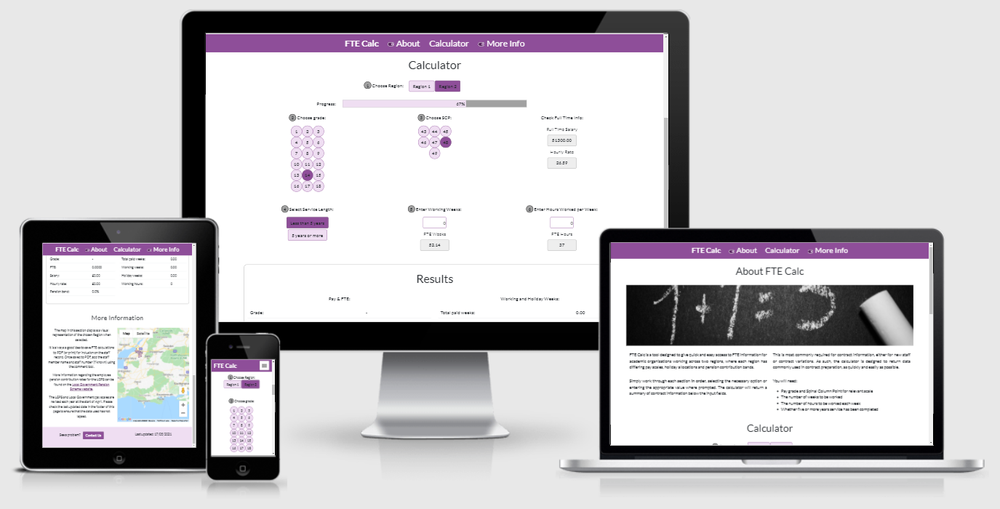

# **FTE Calc**

# Overview
FTE Calc is an interactive calculator designed to make producing full time equivalent salaries for academic support staff quick and easy.  A multi academy trust may well operate over multiple counties with associated pay scales, holiday allowances and pension contribution bands.  Each of those areas may also have subsets which change based on length of service, for example, or by grade.  Translation to term-time only pay from FTE is often undertaken by reading from multiple tables and making manual calculations which leaves a large number of opportunities for human error to creep in.

The calculator is being developed with the input of a multi-academy trust who are in this position, and as such, the color scheme and fonts are in line with their branding, though tweaked a little for accessibility.

The pay scales and other pay data used in this project are entirely fictional. These will be replaced with the actual data when the calculator is finalised and used locally.

# Index
1. [UX](#ux)
    * [User Stories](#user-stories)
    * [Strategy](#strategy)
    * [Scope](#scope)
    * [Structure](#structure)
    * [Skeleton](#skeleton)
    * [Surface](#surface)
1. [Features](#features)
    * [Existing Features](#existing-features)
    * [Features for Future Implementation](#features-for-future-implementation)
1. [Testing](#testing)
1. [Development Life Cycle](#development-life-cycle)
1. [Deployment](#deployment)
    * [Via GitPod](#deployment-of-the-page)
    * [Cloning Locally](#how-to-run-the-code-locally)
1. [Technologies Used](#technologies-used)
1. [Credits](#credits)
    * [Website](#website-credits)
    * [README](#readme-credits)

Note, testing information can be found in a separate document:
* [Testing](TESTING.md)

## UX

### **Overview and Broad Design Choices**
The colour scheme and font choices have been taken from the branding of the academy trust which contributed to the production of the page, however some colour combinations were tweaked slightly to improve acessibility.

Otherwise, the page is designed entirely with the end user in mind, since their goals are completely aligned with those of the owners.  The project is a one page design as the user will want to open the page, enter the data, get the results and close it or restart the calculation for another staff member as quickly as possible.

There is a brief summary of how the calculator works at the top of the page, along with the information required to complete an FTE request.  This is deliberately short and to the point, as a returning user will want to get straight to the calculator every time.

The calculator itself is fluid and dynamic, with the sole intention of reducing the required number of clicks/keystrokes to as few as possible.  Drop down menus were considered for data selection, and a scrolling number selector for hours entry.  These were both rejected on the basis that this approach would require twice as many clicks as simply having dynamic clickable content right there on the page.  The summary data is returned in a plain, simple format to make it easy to copy and paste for inclusion on contracts or pay queries.

There is a closing summary at the bottom of the page referring to any publicly available resources, and reminding the user to print or save the page as evidence of the basis of calculation.  Finally, this section asks the user to check that the pay scales have not been changed (this generally happens annually) since the page was last updated, with the last updated date shown clearly in the footer.

The footer also contains a Contact modal link which feeds back to the developer, so that any issues can be resolved.

### **User Stories**
1. As a new user, I want to immediately find information on how to use the website.
1. As a new user, I want to immediately find information on what I need to complete the task I came for.
1. As a new user, I want to very quickly, intuitively learn exactly how the calculator is used to get the data I came for.
1. As a returning user, I want to get straight to using the calculator without pointless interaction such as scrolling or clicking.
1. As a returning user, I want to be able to provide feedback with regard to my needs/issues with the website.
1. As a frequent user, I want to know that the webiste is updated with relevant infomation in a timely manner, or to be able to update the source data myself.

These stories are addressed fully in the [Testing](TESTING.md) document.

### **Strategy**
Who is the website for?
What does the owner of the website need/want?
What do the users of the website need/want?

Broadly, how does the website meet these needs?

Owner aims:
* 
* 
* 
* 
* 

User aims:
* 
* 
* 
* 
* 

### **Scope**
Why does the website exist?  What does it need to meet the user/owner aims?

#### Feature Viability

| # | Feature | Importance | Viability | Comment |
|---| ------- | :--------: | :-------: | ------- |
1.| Feature  | 0 | 0 | Y - Why
2.| Feature  | 0 | 0 | Y - Why
3.| Feature  | 0 | 0 | Y - Why
T.| Total score | 0 | 0 |

#### Feature Plan
First increment:
* 

Second increment:
* 

Third increment:
* 

### **Structure**
* See Information Grouping [mind map here](assets/documents/structure.pdf).

### **Skeleton**
In line with structure planning... 

#### Wireframes

##### Original
1. [Mobile](assets/documents/XXXXX-mobile.pdf) 375px
1. [Tablet](assets/documents/XXXXX-tablet.pdf) 768px
1. [PC/Laptop](assets/documents/XXXXX-pc.pdf) 1200px

##### Final
1. [Mobile](assets/documents/XXXXX-mobile-final.pdf) 375px
1. [Tablet](assets/documents/XXXXX-tablet-final.pdf) 768px
1. [PC/Laptop](assets/documents/XXXXX-pc-final.pdf) 1200px

##### Summary of Changes
* 

### **Surface**

#### Colours
Thought process behind colour choices and palette development.

#### Typography
Thought process behind font choices.
1. 
1. 
1. 

## Features

### **Existing Features**
Features common to all pages/sections:

#### XXXXX

### **Features for Future Implementation**
1. What | Why

## Testing

This information is held in the [Testing](TESTING.md) file.

## Development Life Cycle

This section is to provide an brief insight into how the approach to the code structure of the website was expected to work, what changed and why, and then to summarise how the creator would now approach replicating the project.

Changes to design are documented in the [UX section](#ux) under [wireframes](#wireframes).

The project was deployed using GitHub pages once the basic structure of the page was complete.  This allowed for continuous delivery as each change was made, and pushed and enabled testing of the page during development on different devices.

Commits were made as each section of each page was added and pushed once a section was complete.

### **Reflections on General Approach to Build**
What would be done differently next time?  What went right?  Overall opinion.

### **Lessons Learned**

#### Preparation

#### Build

### **Revised Development Process**

Based on the experience of producing the website, the creator would now take the following approach.

#### Preparation

#### Build

## Deployment

The website was created using [GitPod](https://www.gitpod.io/). Version control was undertaken by committing to [Git](https://git-scm.com/) and pushing to [GitHub](https://github.com/) using the functions within GitPod.

### **Deployment of the Page**
1. In the IDE, ensure the tree is clean, and all required items have been committed and pushed to the repository in GitHub.
1. Sign in to GitHub.
1. Navigate to the appropriate repository: `XXXXX`
1. From the repository menu, choose Settings.

1. On the sidebar menu to the left, find the Pages section.
1. From the first dropdown box, choose the Master branch, then click save.

1. The page will refresh, and the Pages section now shows a URL for the deployed site.
1. Click the URL to view the deployed website.

### **How to Clone and Run the Code Locally**
There are slightly different approaches should you choose to use GitPod to clone the project, or a local IDE.

#### Cloning a Project into GitPod
1. Use [Google Chrome](https://www.google.com/intl/en_uk/chrome/). *(This can also be undertaken in Firefox)*
1. If you do not already have one, [create a GitHub account](https://github.com/join).
1. Install the [GitPod browser extension for Chrome](https://chrome.google.com/webstore/detail/gitpod-dev-environments-i/dodmmooeoklaejobgleioelladacbeki). *(Or Firefox if appropriate)*
1. Restart Chrome.
1. In GitHub, find the [project repository](https://github.com/XXXXX).
1. From the repository menu, choose the green GitPod button.

1. A new GitPod workspace will open containing the project code.

#### Cloning a Project into a Local IDE
1. Navigate to the [GitHub Repository](https://github.com/XXXXX).
1. Choose the Code dropdown menu, and copy the URL.

1. Open your local IDE and then open a terminal.
1. Set the current working directory to your preferred location for the cloned project.
1. Type in "git clone " followed by the copied URL. Be sure to include a space between git clone and the url, then press enter.
1. The cloned project will be created.

You can find more information on cloning a repository from GitHub [here](https://docs.github.com/en/github/creating-cloning-and-archiving-repositories/cloning-a-repository).

## Technologies Used

### **Languages**
* HTML5 is used to provide the basic structure of the website.
  * About: [HTML5 Wiki](https://en.wikipedia.org/wiki/HTML5)
  * Creator: [W3 Consortium](https://www.w3.org/)
* CSS3 is used to provide most of the styling for the website.
  * About: [CSS3 Wiki](https://en.wikipedia.org/wiki/CSS)
  * Creator: [W3 Consortium](https://www.w3.org/)
* JavaScript is used to provide the interactive nature of such components throughout the website.
  * About: [JavaScript Home](https://www.javascript.com/)

### **Libraries and Frameworks**
* [Bootstrap 5](https://getbootstrap.com/) is used to provide the grid functionality for uniform design, responsiveness and to enable the use of modal and hamburger menu.
* [jQuery](https://jquery.com/) is used to simplify the implementation of interactive JavaScript components.
* [Google Fonts](https://fonts.google.com/) are used to provide the typography for the website.
* [Font Awesome](https://fontawesome.com/) is used to provide the icons for the website.

### **Tools**
* [Git](https://git-scm.com/)/[GitHub](https://github.com/) was used for version control and repository storage.
* [GitPod](https://www.gitpod.io/) was the IDE used to write the project.
* [Chrome Dev Tools](https://developers.google.com/web/tools/chrome-devtools) were used for specific responsiveness testing and drilling down into bug fixing.
* [Lighthouse](https://developers.google.com/web/tools/lighthouse) was used for macro testing and identification of errors for rectification.
* [W3C CSS Validation Service](https://jigsaw.w3.org/css-validator/) was used to remove any remaining errors in CSS code.
* [W3C HTML Validation Service](https://validator.w3.org/) was used to remove any remaining errors in HTML code.
* [JS Hint Validation Service](https://jshint.com/) was used to check for major errors in JavaScript.
* [Responsively](https://responsively.app/) was used to explore responsiveness across various devices.

### **Other Resources**
* [Code Institute Full Template](https://github.com/Code-Institute-Org/gitpod-full-template) was used to set up the repository.

## Credits

### **Website Credits**

#### Content
Where did the website content come from?

#### Media
* The photographs used for the website were obtained from [Pexels.com](https://www.pexels.com/):

* The diagrams used for the website were obtained from various places:

#### Acknowledgements
Thank you in particular to:
* Reuben Ferrante for mentoring the project.

### **README Credits**

#### Content
Structure and content based heavily on:
* [Code Institute Solutions - README Template](https://github.com/Code-Institute-Solutions/readme-template)
* [Daisy McGirr - Code Institute Testing Webinar](https://us02web.zoom.us/rec/play/9FIKllHX2ZiQNFRhYPn_hBh_ZeA8964ZvIDLnhpKGAf1NLVc3_hBJ6zSL8Hv5Hx7ALnPtDmbg8CmFAs.YVsZ9LR_uI7OjEwH)

#### Media
The images for this README are from the following sources:
* Snips taken from GitHub.
* [Am I Responsive](http://ami.responsivedesign.is/).
* Wireframes created with [Balsamiq](https://balsamiq.com/).
* Colour mockups created with [Coolors](https://coolors.co/).
* Snips taken of Google Fonts.

#### Other
* Markdown basic taken from [Mastering Markdown](https://guides.github.com/features/mastering-markdown/).

**This website was produced as an educational project for the Code Institute Full Stack Development course.**

**Created by Amy Hacker.**

[Back to Top](#XXXXX)