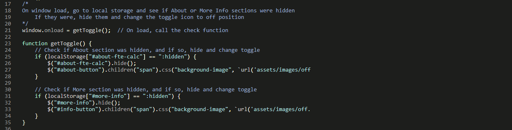

# **FTE Calc**

# Testing

A plan and log for testing the website, this is a manual testing plan due to the limitations of the developer at this time, and the nature of the page.

# Index
1. [Validation Testing](#validation-testing)
1. [Logic Error Testing](#logic-error-testing)
1. [Client Stories Testing](#client-stories-testing)
1. [Manual Testing](#manual-testing)
    * [Common Elements](#common-elements)
    * [Page Specific Sections](#page-specific-sections)
    * [Accessibility](#accessibility)
1. [Bugs](#bugs)

## Validation Testing
The project code has been passed through the following code validators:
* [HTML Code Validator](https://validator.w3.org/) (All pages were checked)

* [CSS Code Validator](https://jigsaw.w3.org/css-validator/) (One warning - external stylesheets are not checked)

* [JS Hint](https://jshint.com/) (A number of unused variables/undefined variables were found when checking each file, the majority of these relate to items called/defined in other files.  Those which do not relate to external resources for Google Maps API and EmailJS)
    * calc.js

    * email.js

    * maps.js

    * polygons-map.js

    * script.js

    * source-data.js

* The project has been assessed throughout development using [Lighthouse](https://developers.google.com/web/tools/lighthouse).

## Logic Error Testing
The calculator uses a lot of logic, with the full application tested every time a new component was added or anything changed.  A summary of items tested, their issues and their resolution is below.

## Client Stories Testing
1. As a new user, I want to immediately find information on how to use the website.
    * On first visit the user is presented initially with the About section, which briefly describes what the tool is and how the tool should be used.
    
1. As a new user, I want to immediately find information on what I need to complete the task I came for. 
    * The About section also contains information on what is required to use the site.
    
1. As a new user, I want to very quickly, intuitively learn exactly how the calculator is used to get the data I came for.
    * The Calculator has clear step indicators showing where to start, for the first few steps the next section does not populate until the currently required section os completed
    * Should the numerical order or standard left-to-right reading flow not be sufficient, the Calculator will display guidance messages if any of the available steps are completed out of sequence.
    
1. As a returning user, I want to get straight to using the calculator without pointless interaction such as scrolling or clicking. 
    * The About and More Info sections can both be toggled off.  This preference is saved to local storage each time it is changed, and should mean that the sections are displayed as the user last left them.
    
1. As a returning user, I want to be able to provide feedback with regard to my needs/issues with the website.
    * The footer contains a prominent Contact Us button which prompts a contact form in a modal.  This contains as few fields as possible.
    
1. As a frequent user, I want to know that the website is updated with relevant infomation in a timely manner, or to be able to update the source data myself.
    * The website shows the last updated date clearly in the footer.  This can be used to easily determine the age and relevance of the information it contains.
    * In addition, the FTE check which appears after step 3 should be compared with a current copy of the relevant pay scales, which will also determine whether the data is current.
    * It is not currently possible for the user to update pay scales, but this is planned for the future.
    

## Manual Testing

### **Common Elements**

These components are present on every page, and each page has been tested.

---

#### Navigation Bar

**Intent** - a navbar which collapses to hamburger on mobile.

* All links are valid and link to the appropriate page/section.
* Toggle effects display correctly where relevant.
* Hover effect occurs correctly for each navigation section.
* Resize to mobile/tablet and check that navigation bar collapses to hamburger.
* Expand hamburger menu and check all sections present, and displaying correctly.
* Fixed nav does not obscure any content.

**Result** - Both pages opened on PC/laptop, Hudl 2, Nexus 10, Pixel XL, Xiaomi MI9 (Chrome and Firefox) and in Safari on an iMac.  All features respond correctly, no broken links.  Toggle sections work and display correctly and hamburger presents as it should.

**Verdict** - Pass

---

#### Hero Images

**Intent** - a graphic introduction to the page using an image relevant to the page content.  Primary purpose, to elicit a positive emotional response from the user.  The image should display correctly on all device sizes.  The image should display 30% height as the focus should be on the data and the tool.

* Image fills the viewport as expected depending on page.
* Resize to mobile/tablet and check that image still displays without distortion.
* Text remains centered with no overflow at mobile/tablet.
* Image does not become pixellated on larger screens.

**Result** - Tested as above on multiple devices.  Image displays correctly in all tested scenarios.

**Verdict** - Pass

---

#### Footer

**Intent** - The footer should be reflective of the design of the nav to bookend each page and provide familiarity to the user.  This helps with intuitive learning.  Any external links should open in new tabs and provide user feedback when hovered over.

* Footer appears in two sections.
* Buttons display correctly, and show feedback behaviour on hover.
* Modal is opened correctly, and email facility works.
* Resize to tablet and check for text overflow issues.
* Resize to mobile and check that sections wrap neatly below one another.

**Result** - Tested on devices as above, all features work as expected, no issues with display or function.

**Verdict** - Pass

---

### **Page Specific Sections**

These items are specific to each individual page.

#### Basic Plan for Body Sections
* Check all areas of text align appropriately, horizontally and vertically.
* Check that behaviour is correct for mobile/tablet.
* Check that any links, buttons or fields show feedback behaviour on hover.
* Check that any links navigate to correct pages.
* Check that any external links open in a new tab, to the correct place.
* Check that any icons do not overflow into text on mobile/tablet.

---

#### Calcultor Home Page

**Intent** - Allow the user to quickly learn about the tool and get started using it as quickly as possible.  If returning user, allow the user to start using the tool immediately.

* All text sections display correctly across tested device widths.
* All buttons and links display user feedback on hover.
* All internal links navigate to the correct page/section.
* Toggle behaviour works as expected, updating section and icon.
* Returning to the page recalls status of toggled sections.
* Progress bar fills as steps completed/overwritten (PC only).
* All calculator bucket components populate as expected.
* All user errors are handled clearly and instruction given to the user to correct.
* Results field populates and clears properly as appropriate choices are made in the calculator.
* Map displays, and shows polygon when region is selected.

**Result** - All elements display as expected, on all devices tested.  Interactive components exhibit correct user feedback.
Specifically:
* Calculator, Results, About and More sections wrap as expected on PC/tablet/mobile.
* Progress bar fills appropriately regardless of step selected.
* All dynamic content populates as expected and is correctly interactive.
* Results field populates on completion of step 6 and clears when interacting with any other step.
* Map displays and Polygons appear as they should.

**Verdict** - Pass

---

#### Contact Us Modal

**Intent** - Encourage the user to get in touch with the owners, and make it as easy as possible to do so.

* All text sections display correctly across tested device widths.
* All buttons display user feedback on hover.
* Form contents align nicely and that there is no overflow of content.
* Fields display correctly on mobile/tablet and PC.
* Fields and submit button display feedback on hover.
* Fields display feedback on focus.
* Try to submit blank form, error messages display with information.
* Try to submit email in incorrect format, error message displays with information.
* Try to submit form without question, error message displays with information.
* Submit correctly completed form, receive success modal or error message.
* If successful, form resets after 10 seconds.
* Clear modal escape options available at all times.
* Modal information centers correctly with no overflow on all device widths.

**Result** - All fields display as expected and client side validation functional.  At all times both Close and "X" buttons are present.  User feedback for hover/focus is as desired, and the success/error feedback is in line with expectations.

**Verdict** - Pass

---

#### 404

**Intent** - Catch users who would normally encounter a browser generated 404 page, and redirect them back to the website as cleanly as possible.

* All text sections display correctly across tested device widths.
* All buttons and links display user feedback on hover.
* All internal links navigate to the correct page/section.
* User is guided back to the home page.
* Mistyped url for website to ensure 404 page displays in such situations.
* Deliberately broke page link to ensure 404 page will display in this instance too.

**Result** - All elements display as expected, on all devices tested.  Interactive components exhibit correct user feedback.  Large button redirects to Calculator page correctly.
Mistyped url and broken link tests successful.

**Verdict** - Pass

---

### **Accessibility**

The colourblind feature on Coolors was used to check that the colours appeared sufficiently different, and not jarring for these users.

As well as the use of the Lighthouse assessments of accessibility, the website was browsed at intervals by two users who may experience difficulty.  A dyslexic user with ASD and a colourblind user both participated in testing for this project at various stages.

Users of screen readers have been vorne in mind when implementing each section.  All interactive content is fully navigatable by keyboard and default behaviours have been preserved where known when implementing custom interactions.

There is some concern regarding screen reader requirements which are not known to or understood by the developer, but referring to the W3C [WAI-ARIA documentation](https://www.w3.org/WAI/standards-guidelines/aria/) has hopefully mitigated this as much as possible.

## Bugs

Details of any persistent or difficult bugs, and any bugs which remain unresolved.

### **Fixed Bugs**

#### **Section togglers and local storage**

After discussion with the development partners, it was decided that the About section in particular required the user to scroll past the instructions on each use and should therefore be toggle-able.  The More Information section was less intrusive, but again, should the user wish to use the contact modal the More Info section must be scrolled first.

A click event listener was added to the navigation links, along with toggle images to indicate whether the section is visible or hidden and sildeToggle used to show or hide the sections.

The default behaviour of the links caused the page to navigate to the location of the hidden section, which is particularly unhelpful.  The href attribute was removed from the links to stop this, but it resulted in the unhidden sections not being scrolled to either.  Further issues with this approach were that the links became unselectable by keyboard and therefore could not be activated by users with screen readers or other accessible technologies.

Initially if(:hidden) was used to determine the status of the section and prevent default if hidden.  This also changed the toggle image as appropriate.  However, once evaluated, :hidden will always return the same result.  It was necessary to evaluate if hidden separately and then call the toggle behaviours accordingly which resulted in a lot of repeated code.  It also took some trial and error to understand how the code assessed status and assign the toggle image and scroll-behaviour accordingly.

The fixed nav (required for effective and accessible toggling) caused the title of the toggled section to be hidden on the default behaviour of the link despite the use of scroll-top in CSS.  As such, javascript animate/scrollTop was initiated if the section was not hidden, and an offset used to ensure the newly displayed section was visible in full.  This approach allowed the default behaviour of clicking the link (moving the keyboard selector to the linked section) to continue, whilst simultaneously ensuring the section was displayed.

At review, mentor Reuben Ferrante explained the use of state which was then used to condense the code for this feature considerably.

Finally, the user could easily toggle the sections off, but the next time the page was loaded the sections would be toggled back on again.  Local storage was used to save the status of the toggled sections such that the user can leave them toggled off if desired.

#### **Validation & reset of Bootstrap email modal on send**

The input fields for the modal are all verified client side using the browser/HTML attribute Required. Clicking Send on the Bootstrap modal did nothing in terms of user feedback. The EmailJS boilerplate has response and error handling built in, but this simply logs to the console.

Added some JavaScript to the EmailJS boilerplate code for response/error to replace the modal contents (form) with a success message, or an error message as appropriate.

This worked when tested, but resulted in the modal contents being fixed at the success or error message when reopened.  Whilst this behaviour is desirable for a failed message (no point allowing repeat attempts should there be a problem), it was not desirable for a successful transmission.

A timeout function was also added to the response code, which would reset the contents of the modal back to the form after 10 seconds.

The user has multiple options to escape the modal at all times.

The success and error messages were shown correctly at all times when tested.

#### **Printing**
It is necessary to save a copy of the calculation to the file of the staff member for personnel records.  Only the calculator and results sections are required for this, so CSS @print styles were added to remove all unnecessary content form printing, which was successful.

The Bootstrap breakpoints mean that on most browsers an A4 page is seen as a small viewport and therefore the mobile display appeared on the page by default in one long, multi page document.  A number of approaches were tried to correct this but the eventual course of action chosen was to write specific print classes to override the Bootstrap breakpoints when printed.

This is a small section in the bugs note, but consumed a disproportionate amount of time.  It is unfashionable to print web pages, and so resources for the issue and hand were scarce and unspecific, usually relating to the correction of graphics to produce better printed results etc.

### **Remaining Bugs**
There are no known remaining bugs in the application.

Testing first completed 23/05/2021 - AKH
Testing repeated XX/XX/2021 - AKH

[Return to Top](#title)